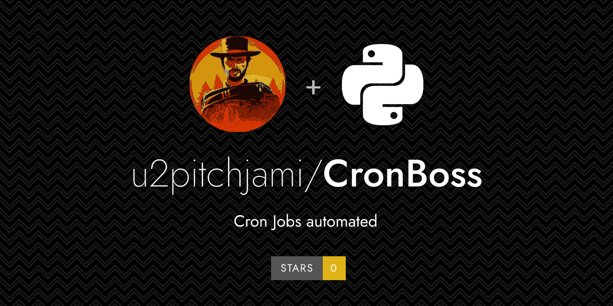

## 🎯 Objectif principal

Le but de ce projet est de faciliter et de personnaliser les tâches cron.
Il permet de gérer des scripts bash et python avec gestion de l'environnement virtuel.
De plus il gère la suppression auto de logs ou autres fichiers générés par mes scripts.

## 🔹 Contexte & Motivation

Le paramétrage du cron est souvent fastidieux avec un gros problème de souplesse, notamment pour les scripts python.
Ici le dossier d'execution, l'environnement python sont gérés automatiquement.

---

## 🧰 Installation :

### Création de l'environnement virtuel :
C'est un projet python, donc qui nécessite l'utilisation d'en environnement virtuel.

- commencez par rendre le script install_env.sh exécutable
	- ``` sudo chmod +x install_env.sh```
	- ``` sudo chmod +x run_cronboss.sh```
- puis
	- ``` install_env.sh```

cela va automatiquement créer l'environnement virtuel python avec les dépendances nécessaires.

### Insertion dans crontab -e :
votre seule intervention dans crontab.

- ouverture de crontab
	- ``` crontab -e```
- paramétrage du cronhub
	- ``` */15 * * * * /path/to/cronboss/run_cronboss.sh```
	- ici le script sera exécuté toutes les 15 minutes, adaptez le en fonction de vos besoins. Mais plus le délai est court et plus cela offre de la souplesse pour cronboss


### **Paramétrage du fichier .env :**
affichez le fichier .env et paramétrez le en fonction de votre setup.

```env
#LOGS
LOG_FILE_PATH=/path/to/cronboss/logs
LOG_ROTATION_DAYS=30

```env
INTERPRETERS_PATH=/path/to/venvs.yaml
```
*--> fichier nécessaire pour les scripts python*

```env
#INTERVAL
CRON_INTERVAL_MINUTES=15
```
*--> indiquez l'intervale choisi dans le crontab -e
cela sert à gérer les écarts entre l'éxécution du cronboss et le paramétrage de vos tasks.
Exemple : ici crontab -e à 15 minutes (donc aux minutes 0, 15, 30, 45)
Si dans vos tâches vous placez un script à la minute 20, sans le CRON_INTERVAL_MINUTES il ne sera jamais exécuté, mais là, il va checker l'intervale entre les 2 exécution et lancer à 30 le script programmé à 20.
Si vous laisser CRON_INTERVAL_MINUTES=0 cela désactive l'action de rattrapage et le script programmé à 20 ne sera pas exécuté.*

```env
#ENV
ENV_PYTHON=/path/to/.venv
```
*--> env python par défaut si aucune n'est mentionné, par défaut indiquer l'env créé grâce au script plus haut mais n'est utile que pour les scripts python, pas pour bash.*

## **⚙️Paramétrage des tâches :**
Le concept repose sur des listes de tâches au format yaml que vous allez déposer dans le dossier "tasks" du projet.

```yaml 
- type: python
```
*--> python ou bash*

  ```yaml
  interpreter: path/to/env du script
  ```
 ** --> optionnel et uniquement pour python si l'env n'est pas géré par venvs.yaml
  script: /absolute/path/to/script/truc.py 

```yaml
  args: "arguments" # --> optionnel, si votre script nécessite un ou plusieurs arguments
  exclusive: true --> true/false authoriser ou non le lancement d'un script déjà en cours (si non indiqué, par défaut "true")
  hours: any ou [0, 5, etc...]
  minutes: any ou [0, 25, 45, etc...]
  days: any (chaque jour)
```
*ou -->*
```yaml
  days :
    day: [1, 15] # --> exécution le 1er et le 15 du mois
    weekday: [0, 5] # --> exécution le lundi et le samedi de chaque semaine (cumulable avec day: [1, 15])
```

```yaml
  enabled: true # ou false (si false la tâche ne sera pas exécutée)
  cleanup:
    paths:
      - /path/to/file
    rule:
      keep_days: 14
      extensions: [".log"] #ou autre en fonction du besoin
      recursive: true #(peut être utile si vos logs des différents scripts de votre projet dans à la même racine, du coup il va gérer tous les sous dossiers et donc pas besoin de la paramétrer sur les autres)

```

Je vous recommande un fichier par projet mais ça n'est pas obligatoire.

### Spécificité Python :
Les scripts python nécessite une environnement pour fonctionner correctement.

Le script utilisera dans l'ordre :
 - la donnée "interpreter:" du fichier yaml par la tâche en question
 - la donnée du fichier venvs.yaml qui concerne tous les scripts python d'un projet
 - l'env par défaut (probablement celui qui vous aurez créé), mais sans l'assurance que les dépendances nécessaires soient présentes.

### Comment remplir le fichier venvs.yaml ?

```
project1: /path/to/.venv/bin/python3
project2: /path/to/.venv-mixo/bin/python3
```

project1 et project2 (ou autre nom) doivent être présents dans ce fichier mais également comme nom de fichier yaml du dossier "tasks"
donc ici project1.yaml par exemple.

Si aucun interpreter des scripts python n'est indiqué dans les tâches de project1.yaml, cronboss va checker dans venvs.yaml si un env global au projet est indiqué.


## Authors

👤 **u2pitchjami**

[](https://bsky.app/profile/u2pitchjami.bsky.social)
[](https://twitter.com/u2pitchjami)


* Twitter: [@u2pitchjami](https://twitter.com/u2pitchjami)
* Github: [@u2pitchjami](https://github.com/u2pitchjami)
* LinkedIn: [@LinkedIn](https://linkedin.com/in/thierry-beugnet-a7761672)

## 🔗 Liens utiles
- 📜 [Documentation](../Resources/Documentation.md)
- 📂 [Dépôt GitHub](https://github.com/user/projet)`