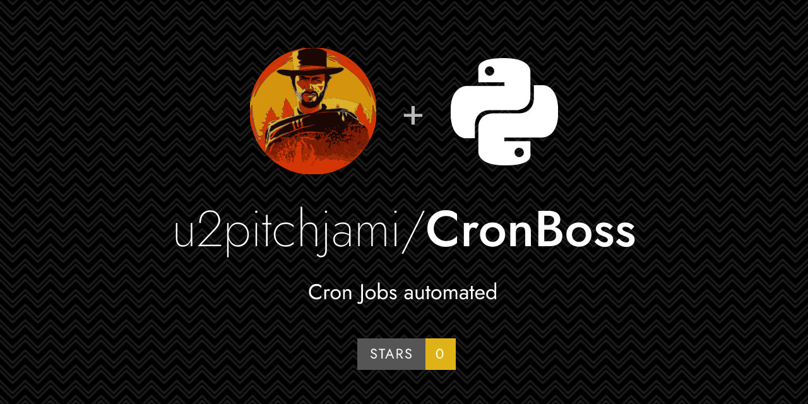

# 🕒 CronBoss

## 🎯 Objectif principal
CronBoss est un outil d’automatisation et de planification de tâches, pensé pour **simplifier et enrichir le cron classique**.  
Il permet de lancer des scripts **Python** ou **Bash**, de gérer automatiquement les environnements virtuels, les logs, les nettoyages, et d’envoyer des **notifications en temps réel** (ex. Discord).

---

## 🔹 Contexte & Motivation
Le cron natif est rigide et peu adapté à la diversité des workflows modernes (scripts Python multi-envs, logs, monitoring, etc.).  
CronBoss apporte une **couche de flexibilité et de contrôle** :  

- Déploiement rapide (une ligne dans crontab)  
- Planification intuitive via YAML  
- Gestion des environnements Python multi-projets  
- Notifications et reporting intégrés  
- Exclusivité des tâches (éviter les doublons en cours)  

---

## 🧰 Stack technique
- **Python 3.11+**  
- **Bash** (scripts install/run)  
- **Crontab** (intégration native Linux/Unix)  
- **YAML** (planification des tâches)  
- **dotenv** (.env pour configuration)  
- **VM Ubuntu (Unraid)** : exécution centralisée  
- **Discord Webhooks** (notifications)  

---

## ⚙️ Installation

### 1. Création de l'environnement virtuel
```bash
sudo chmod +x install_env.sh
sudo chmod +x run_cronboss.sh
./install_env.sh
```

### 2. Intégration dans `crontab -e`
```bash
*/15 * * * * /path/to/cronboss/run_cronboss.sh
```
➡ Ici toutes les 15 minutes, ajustez selon vos besoins.  

### 3. Paramétrage `.env`
```env
# Logs
LOG_FILE_PATH=/path/to/cronboss/logs
LOG_ROTATION_DAYS=30

# Interpreters
INTERPRETERS_PATH=/path/to/venvs.yaml

# Intervales
CRON_INTERVAL_MINUTES=15

# Environnement Python par défaut
ENV_PYTHON=/path/to/.venv

# Discord Notifications
# This is the Discord webhook URL for sending notifications.
DISCORD_WEBHOOK_URL=https://discordapp.com/api/webhooks/xxxxx

# Notifications par défaut si non définies dans YAML
DEFAULT_NOTIFY_ON=none

# Traiter les warnings comme des échecs
WARNINGS_AS_FAILURE=false

# Envoyer un résumé global par exécution de CronBoss
SEND_SUMMARY_DISCORD=false
```

### 🔑 Comment obtenir un Webhook Discord ?
1. Ouvrir votre **serveur Discord**  
2. Aller dans **Paramètres du serveur > Intégrations > Webhooks**  
3. Créer un **nouveau webhook**, lui donner un nom et choisir un salon cible  
4. Copier l’URL fournie et la coller dans `DISCORD_WEBHOOK_URL` de votre `.env`  

---

## 📝 Exemple de tâche YAML

### Script Python
```yaml
- type: python
  script: /home/user/dev/project/scripts/analysis.py
  args: --count 150
  hours: [0, 12]          # exécution à minuit et midi
  minutes: [0]
  days: any               # tous les jours
  exclusive: true         # pas deux instances en parallèle
  enabled: true
  retries: 1
  retry_delay: 30         # en secondes
  timeout: 600            # en secondes
  notifications:
    notify_on: ["failure"]
    channels: ["discord"]
```

### Script Bash
```yaml
- type: bash
  script: /home/user/dev/project/scripts/do_backup.sh
  hours: any
  days:
    weekday: [0, 5]       # lundi et vendredi
  enabled: true
  exclusive: true
```

---

## 📂 Champs YAML supportés

| Champ           | Exemple                        | Description |
|-----------------|--------------------------------|-------------|
| `type`          | `python` / `bash`             | Type de script |
| `script`        | `/chemin/vers/script.py`      | Script à exécuter |
| `args`          | `--opt value`                 | Arguments optionnels |
| `hours`         | `[0, 12]` / `any`             | Heures d’exécution |
| `minutes`       | `[0, 30]` / `any`             | Minutes |
| `days`          | `[1, 15]` ou `{weekday: [0,5]}` / `any` | Planification |
| `enabled`       | `true` / `false`              | Active/désactive la tâche |
| `exclusive`     | `true` / `false`              | Empêche 2 exécutions simultanées |
| `retries`       | `1`                           | Nb de tentatives en cas d’échec |
| `retry_delay`   | `30`                          | Délai entre retries (sec) |
| `timeout`       | `600`                         | Timeout max (sec) |
| `cleanup`       | `paths: [...]` + `rule:`      | Nettoyage fichiers/logs |
| `notifications` | `notify_on: [...]` + `channels: [...]` | Notifications |

---

## 🔔 Notifications
- **Discord** (déjà supporté) : configurable par tâche ou globalement via `.env`  
- `DEFAULT_NOTIFY_ON=none` → aucune notif par défaut  
- `WARNINGS_AS_FAILURE=true` → interprète les warnings comme des échecs  
- `SEND_SUMMARY_DISCORD=true` → envoie un résumé des exécutions dans une seule notif  

Exemple résumé auto :
```
📊 RÉSUMÉ : ✅ 3 succès | ❌ 2 échecs | ⏱️ Durée totale : 120.53s
```

**À venir** : mails, Slack, etc.  

---

## 🛡️ Exclusivité
- `exclusive: true` → active un **lock fichier** par tâche, évitant les doublons  
- `exclusive: false` → script relançable en parallèle  

---

## 📊 Logs & Stats
- Logs lisibles (`logs.log` par défaut) avec ✅ succès / ❌ échec / 🔄 retry / ⏱ timeout  
- Génération optionnelle de **stats JSON** (durées, status…) pour futur dashboard  

---

## 📦 Roadmap
- 📧 Notifications par mail et autres canaux  
- 🗄️ Réflexion sur l’orga YAML vs base de données (voire hybride)  
- 🌐 Web UI possible pour gestion centralisée des tâches & stats  
- 🔄 Déploiement futur en **service** (systemd) en plus du crontab  

---

## 👤 Auteur
👤 **u2pitchjami**  

[](https://bsky.app/profile/u2pitchjami.bsky.social)  
[](https://twitter.com/u2pitchjami)  
  
  

- Twitter: [@u2pitchjami](https://twitter.com/u2pitchjami)  
- Github: [@u2pitchjami](https://github.com/u2pitchjami)  
- LinkedIn: [Thierry Beugnet](https://linkedin.com/in/thierry-beugnet-a7761672)  

---
